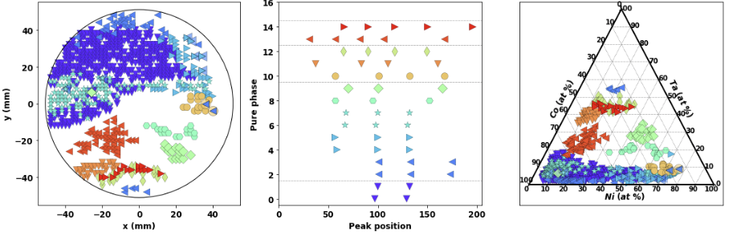
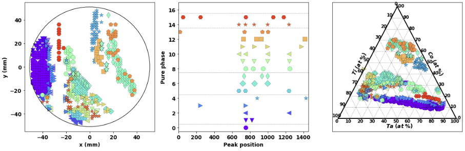

### An Incremental Phase Mapping Approach for X-ray Diffraction Patterns using Binary Peak Representations

Despite the huge advancement in knowledge discovery and data mining techniques, the X-ray diffraction (XRD) analysis process has mostly remained untouched and still involves manual investigation, comparison, and verification. Due to the large volume of XRD samples from high-throughput XRD experiments, it has become impossible for domain scientists to process them manually. Recently, they have started leveraging standard clustering techniques, to reduce the XRD pattern representations requiring manual efforts for labeling and verification. Nevertheless, these standard clustering techniques do not handle problem-specific aspects such as peak shifting, adjacent peaks, background noise, and mixed phases; hence, resulting in incorrect composition-phase diagrams that complicate further steps. Here, we leverage data mining techniques along with domain expertise to handle these issues. In this reposotiry, we provide an incremental phase mapping approach based on binary peak representations using a new threshold based fuzzy dissimilarity measure. The proposed approach first applies an incremental phase computation algorithm on discrete binary peak representation of XRD samples, followed by hierarchical clustering or manual merging of similar pure phases to obtain the final composition-phase diagram. We evaluate our method on the composition space of two ternary alloy systems- Co-Ni-Ta and Co-Ti-Ta. Our results are verified by domain scientists and closely resembles the manually computed ground-truth composition-phase diagrams. The proposed approach takes us closer towards achieving the goal of complete end-to-end automated XRD analysis.

The composition-phase diagram using proposed approach are shown below for both systems:

### Co-Ni-Ta composition-phase diagram

  

### Co-Ti-Ta composition-phase diagram

  

## Developer Team

The code was developed by Dipendra Jha from the <a href="http://cucis.ece.northwestern.edu/">CUCIS</a> group at the Electrical and Computer Engineering Department, and K. V. L. V. Narayanachari from the <a href="http://bedzyk.mccormick.northwestern.edu">Bedzyk Research group</a> at the Department of Materials Science and Engineering at Northwestern University.

## Citation

This work was presented at the International Workshop on Domain-Driven Data Mining (DDDM) as a part of the SIAM International Conference on Data Mining (SDM'2021). Please cite the following if you use this work:

1. Dipendra Jha, K. V. L. V. Narayanachari, Ruifeng Zhang, Justin Liao, Denis T. Keane, Wei Keng Liao, Alok Choudhary, Yip Wah Chung, Michael J. Bedzyk, and Ankit Agrawal. "An Incremental Phase Mapping Approach for X-ray Diffraction Patterns using Binary Peak Representations." arXiv, 2022. [<a href="https://arxiv.org/submit/4587364/view">PDF</a>].

## Questions/Comments

email: dipendra.jha@eecs.northwestern.edu, or ankitag@eecs.northwestern.edu 
Copyright (C) 2021, Northwestern University. 
See COPYRIGHT notice in top-level directory.

## Funding Support

This work was performed under the following financial assistance award 70NANB14H01 and 70NANB19H005 from U.S. Department of Commerce, National Institute of Standards and Technology as part of the Center for Hierarchical Materials Design (CHiMaD), DND-CAT located at Sector 5 of the Advanced Photon Source (APS) at Argonne National Lab  supported by DOE under Contract No. DE-AC02-06CH11357,  the MRSEC program of the National Science Foundation (DMR-1720139), and the Soft and Hybrid Nanotechnology Experimental (SHyNE) Resource (NSF NNCI-1542205). Partial support is also acknowledged from DOE awards DE-SC0014330, DE-SC0019358.
